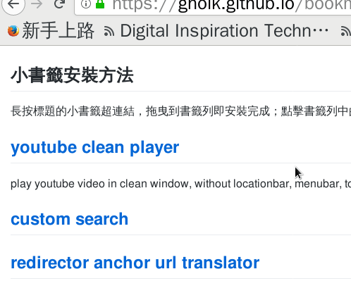

<meta charset="UTF-8">

[get bookmarklet in this page](//gholk.github.io/bookmarklet)

## 小書籤安裝方法
長按標題的小書籤超連結，拖曳到書籤列即安裝完成；
點擊書籤列中的小書籤即可在當下頁面中執行。

<h2>
<a title="play youtube video in clean browser window"
   href='javascript:void function () {const urlToPlayer={};urlToPlayer.youtube=function(location){const scan=location.search.match(/[&\/\?]v=([^&]*)/);const id=scan[1];return"https://youtube.com/embed/"+id};function openCleanWindow(url){window.open(url,"clean youtube player","resizable")}function createButton(){const menuId="menu-container";const button=document.createElement("button");button.textContent="clean window";button.onclick=(()=>{const url=urlToPlayer.youtube(location);openCleanWindow(url)});document.getElementById(menuId).appendChild(button)}openCleanWindow(urlToPlayer.youtube(location));}()'>
   youtube clean player
</a>
</h2>

play youtube video in clean window,
without locationbar, menubar, toolbar, statusbar.

<h2>
  <a href='javascript:void function () {const map={};map.set=function(alias,url,name){this[alias]={url:url,name:name}};map.createForm=function(key){const form=document.createElement("form");const search=this[key];form.action=search.url;form.target="_blank";const input=document.createElement("input");input.name=search.name;form.appendChild(input);return form};map.search=function(key,string){const form=this.createForm(key);form.querySelector("input").value=string;document.documentElement.appendChild(form);form.submit()};map.set("pttpedia","http://zh.pttpedia.wikia.com/wiki/特殊:搜索","query");function promptSearch(string){if(!string)string=prompt("custom search");const scan=string.match(/([^\s]+)\s(.*)$/);const key=scan[1];const value=scan[2];map.search(key,value)}promptSearch();}()'>
  custom search
  </a>
</h2>

<h2>
<a title="jupmer translator"
href='javascript:void function () {var jumperTranslator={urlScheme:null,decode:decodeURIComponent,translate:function(url){const scan;if(scan=url.match(this.urlScheme)){return this.decode(scan[1])}else return null},modifyAnchor:function(anchor){const newUrl=this.translate(anchor.href);if(typeof newUrl=="string")anchor.href=newUrl;return anchor},modifyAllAnchor:function(){for(const anchor of document.querySelectorAll("a")){this.modifyAnchor(anchor)}},promptUrlScheme:function(){const urlRegexpString=prompt("url scheme regexp");this.urlScheme=new RegExp(urlRegexpString)}};jumperTranslator.promptUrlScheme();}()'>
redirector anchor url translator</a>
</h2>

## [generate url QR code][url qrcode]
this bookmarklet will generate QR code image of current url,
and open in the new tab.

[url qrcode]: javascript:void%20function%20()%20%7Bconst%20url=window.location.href;const%20qrcodeUrl=%60http://chart.googleapis.com/chart?chs=150x150&cht=qr&chl=$%7Burl%7D%60;window.open(qrcodeUrl);%7D() "generate QR code image of current url"

## [facebook video rotate]
逆時針方向旋轉方向錯誤的 facebook 浮動影片視窗 90° 。

## [enable select contextmenu]
取消網頁中禁用右鍵與防止選取文字的功能。
有些網頁會禁止反白選取文字，或是禁止右鍵，
這個小書籤可以強制允許右鍵與選取文字，
但不處理禁用 f12 或 ctrl-c 的網頁。

## [hackmd scroll flip]
make mouse scroll flip page in hackmd slide mode.
title is bookmarklet, below is grease monkey user.js:
[hackmd scroll flip user.js] .

## [moodle backup]
在 [成功大學的 moodle][moodle.ncku] 首頁登入後，
點擊該書籤，能自動下載所有課程中教授上傳的講義。
畢竟 moodle 上的資料不會永遠留著，
畢業後還是下載到自己電腦裡比較安心。

事前建議先把瀏覽器對 pdf 檔的動作設成儲存而非開啟，
firefox: *偏好設定 > 應用程式 > 搜尋 pdf > 動作 > 儲存檔案* ，
chromium: *Settings > Privacy and security >
Content settings > PDF documents > Download* 。
另外 chromium 及 firefox 都建議設定預設下載的資料夾，
基本上就能全部自動下載，不會彈對話框。
有時一些檔案格式會無法直接下載，變成在新分頁開啟，
只能再右鍵另存新檔。

點擊書籤後會先彈出對話框要你輸入幾秒下載一個檔案，
建議是 1-3 秒，不要對計中的伺服器造成太大負擔；
輸入後就會開始一一下載。
如果要暫停或中斷，直接關掉分頁時會詢問是否要離開，
同時也會暫停不再下載新檔案。
若選擇停留就會繼續下載新檔案，確定離開就不會再下載新檔案；
下次再執行時會自動從上次下載到一半的課程繼續下載。

firefox 有個 bug，如果下載的檔案是純文字檔 txt，
會無法下載只會直接打開；
所以 firefox 的使用者我改用在新分頁開啟的形式，
防止原本 moodle 的頁面被結束掉。
chrome 好像會跳出大量下載的警告，記得勾允許。

## [screen message]
用螢幕展示大字報。

原來是 debian 上的套件 screen message，有人重寫成網頁版本。
可以在瀏覽器中按 F11 進入全螢幕模式。

我是包成 data url 的形式，
但在 anchor 裡直接放 data url 好像不能直接點擊開啟。
但拖曳到書籤或右鍵加入書籤後，點擊還是可以運作。

## [e3 new grade]
一次將全班的成績全部輸入進交通大學 new e3 教學網站中的評分表格。

 1. 進入課程 > 成績管理 > 編輯成績，
    網址應該是類似 <https://e3new.nctu.edu.tw/theme/dcpc/grade/report/grader/editgrade.php?id=5566&edit=1> ，
    其中 `id=5566` 換成該課程的 id。

 2. 點擊 *e3 new grade* 小書籤，
    會彈出視窗提示使用者點擊要輸入的欄。
    按 ok 後，在要評分的欄的任一學生的成績輸入框中點一下。
 
 3. 會再彈出一個輸入框要求輸入全班的成績，
    請把全班的成績以一行一個分數，
    或用空白分隔也可以，複製後貼到輸入框中，再按確定。
 
 4. 輸入的成績即會依順序填入該欄中的每個輸入框中。

[moodle.ncku]: https://moodle.ncku.edu.tw/
[moodle backup]: javascript:void%20function%20()%20%7Bclass%20MoodleCrawler%7Bconstructor()%7Bthis.sleepInterval=3;this.domParser=new%20DOMParser;this.textDecoder=new%20TextDecoder(%22UTF-8%22)%7Dasync%20fetch(url)%7Breturn%20await%20fetch(url,%7Bcredentials:%22same-origin%22%7D)%7Dasync%20$fetch(url)%7Bconst%20response=await%20this.fetch(url);const%20html=await%20response.text();const%20dom=this.domParser.parseFromString(html,%22text/html%22);return%20dom%7D*extractAllCourseId(document)%7Bconst%20anchorList=document.querySelectorAll(%22.block_course_list%20a%22);for(const%20anchor%20of%20anchorList)%7Bconst%20url=new%20URL(anchor.href);yield%20url.searchParams.get(%22id%22)%7D%7DextractTitle(document)%7Breturn%20document.getElementById(%22logobox%22).textContent.trim()%7D*extractFolder(url)%7Bconst%20folder=this.$fetch(url);const%20fileList=folder.then(dom=%3E%7Breturn%20dom.querySelectorAll(%22.fp-filename-icon%20a%22)%7D);let%20finish=false;let%20index=0;while(!finish)%7Byield%20fileList.then(anchorList=%3E%7Blet%20anchor=null;if(index%3CanchorList.length)%7Banchor=anchorList%5Bindex%5D;index++%7Dif(index%3E=anchorList.length)finish=true;return%7Burl:anchor.href%7D%7D)%7D%7D*extractByType(tr)%7Bconst%20url=tr.querySelector(%22a%22).href;let%20description=tr.querySelector(%22td:last-child%22).textContent;description=description.trim();if(url.includes(%22/mod/resource/view.php%22))%7Byield%7Burl:url,description:description%7D%7Delse%20if(url.includes(%22/mod/folder/view.php%22))%7Byield*this.extractFolder(url)%7Delse%20if(url.includes(%22/mod/page/view.php%22)%7C%7Curl.includes(%22/mod/url/view.php%22))%7Byield%7Burl:url,description:description%7D%7Delse%20console.error(%60unknown%20file%20type:%20$%7Burl%7D%60)%7D*extractAllFile(document)%7Bconst%20tableRowNonEmptySelector=%22#region-main-box%20tr%5Bclass%5D%22;for(const%20tr%20of%20document.querySelectorAll(tableRowNonEmptySelector))%7Byield*this.extractByType(tr)%7D%7Dasync%20$fetchCourseResource(id)%7Bconst%20url=%60https://moodle.ncku.edu.tw/course/resources.php?id=$%7Bid%7D%60;return%20await%20this.$fetch(url)%7Dsleep(second=this.sleepInterval)%7Breturn%20new%20Promise(wake=%3EsetTimeout(wake,second*1e3))%7DgetLastCourseId()%7Breturn%20localStorage.getItem(%22moodle-backup-current-id%22)%7DsetLastCourseId(id)%7BlocalStorage.setItem(%22moodle-backup-current-id%22,id)%7DremoveLastCourseId()%7BlocalStorage.removeItem(%22moodle-backup-current-id%22)%7Dasync%20run()%7Bthis.runInit();let%20lastCourseId=this.getLastCourseId();let%20alreadyDownload;if(lastCourseId)alreadyDownload=true;else%20alreadyDownload=false;for(const%20id%20of%20this.extractAllCourseId(document))%7Bif(alreadyDownload)%7Bif(lastCourseId==id)alreadyDownload=false;else%20continue%7Dthis.setLastCourseId(id);const%20resource=await%20this.$fetchCourseResource(id);const%20title=this.extractTitle(resource);await%20this.sleep();for(let%20file%20of%20this.extractAllFile(resource))%7Bif(file&&file.then)file=await%20file;if(file)%7Bthis.download(file.url);await%20this.sleep()%7D%7D%7Dthis.removeLastCourseId();this.runDestruct()%7DrunInit()%7Bthis.downloadInit();this.preventExitInit()%7DrunDestruct()%7Bthis.downloadDestruct();this.preventExitDestruct()%7DisFirefox()%7Breturn%20navigator.userAgent.match(/firefox/i)%7DdownloadInit()%7Bconst%20anchor=document.createElement(%22a%22);if(!this.isFirefox())anchor.setAttribute(%22download%22,%22%22);anchor.setAttribute(%22target%22,%22_blank%22);document.body.appendChild(anchor);this.downloadNode=anchor%7Ddownload(url)%7Bthis.downloadNode.href=url;this.downloadNode.click()%7DdownloadDestruct()%7Bthis.downloadNode.remove();this.downloadNode=null%7DpreventExitInit()%7Bwindow.onbeforeunload=this.preventExit%7DpreventExit(closeEvent)%7Breturn%22moodle%20backup%20is%20not%20finish,%20do%20you%20want%20to%20exit?%22%7DpreventExitDestruct()%7Bwindow.onbeforeunload=null%7Dasync%20bookmarkletPrompt()%7Blet%20second=prompt(%22download%20file%20interval%20second:%22);this.assert(typeof%20second==%22string%22,%22user%20abrupt%22);second=Number(second);this.assert(second%3E0,%22second%20should%20be%20positive%22);this.sleepInterval=Number(second);await%20this.run();alert(%22download%20finish%22)%7Dassert(test,errorMessage,CustomError=Error)%7Bif(!test)throw%20new%20CustomError(errorMessage)%7D%7Dclass%20MoodleCrawlerDebug%20extends%20MoodleCrawler%7Bconstructor()%7Bsuper();this.sleepInterval=.5%7DextractTitle(document)%7Bconst%20title=super.extractTitle(document);this.currentCourseTitle=title%7Ddownload(url)%7Bconsole.log(this.currentCourseTitle,url)%7D%7Dconst%20moodleCrawler=new%20MoodleCrawler;moodleCrawler.bookmarkletPrompt();%7D() "download all course file from moodle.ncku"

[facebook video rotate]: javascript:void%20function%20()%20%7Bdocument.querySelectorAll(%22div%5Brole=presentation%5D%22).forEach(present=%3E%7Bconst%20container=present.parentNode;if(container.querySelector(%22video%22))%7Bconsole.log(%22get%20video%22,container);const%20ratioOrigin=getRotateRatio(container.style.transform);const%20ratioNext=ratioOrigin-.25;container.style.transform=%60rotate($%7BratioNext%7Dturn)%60%7D%7D);function%20getRotateRatio(cssString)%7Bconst%20scan=cssString.match(/rotate%5C((-?%5Cd+(%5C.%5Cd+)?)turn%5C)/);if(scan)%7Bconst%20ratio=Number(scan%5B1%5D);return%20ratio%7Delse%20return%200%7D%7D() "rotate facebook float video window 90°"

[enable select contextmenu]: javascript:void%20function%20()%20%7Bfunction%20stopEvent(event)%7Bevent.stopImmediatePropagation()%7Dconst%20registFirst=%7Bcapture:true%7D;window.addEventListener(%22contextmenu%22,stopEvent,registFirst);document.addEventListener(%22mousedown%22,stopEvent,registFirst);%7D() "force enable right click (context menu) and text selection"

[hackmd scroll flip]: javascript:void%20function%20()%20%7Bif(document.querySelector(%22.reveal%20.slides%22))%7Bconst%20option=%7B%7D;option.pageup=%7BcharCode:0,keyCode:33,altKey:!1,ctrlKey:!1,shiftKey:!1,metaKey:!1,repeat:!1,isComposing:!1,key:%22PageUp%22,code:%22PageUp%22,type:%22keydown%22,composed:!0%7D,option.pagedown=%7BcharCode:0,keyCode:34,altKey:!1,ctrlKey:!1,shiftKey:!1,metaKey:!1,repeat:!1,isComposing:!1,key:%22PageDown%22,code:%22PageDown%22,type:%22keydown%22,composed:!0%7D,window.addEventListener(%22wheel%22,function(scroll)%7Bscroll.preventDefault();let%20keyOption;keyOption=scroll.deltaY%3E0?option.pagedown:option.pageup;const%20key=new%20KeyboardEvent(%22keydown%22,keyOption);document.dispatchEvent(key)%7D,%7Bpassive:!1%7D)%7D%7D() "make mouse scroll flip page in hackmd slide mode"
[hackmd scroll flip user.js]: https://gist.github.com/GHolk/4a2edcf9cf3f956ec7eb7d7823348b6c/raw/1c71ecd469701cfadf149d9687a785c5294191ef/hackmd-scroll-flip.user.js

[screen message]: data:text/html;base64,PGh0bWw+CjwhLS0KIyAgICAgc20uaHRtbAojICAgICBDb3B5cmlnaHQgKEMpIDIwMDYgLSAyMDEwIEpvYWNoaW0gQnJlaXRuZXIKIwojICAgICBUaGlzIHByb2dyYW0gaXMgZnJlZSBzb2Z0d2FyZTsgeW91IGNhbiByZWRpc3RyaWJ1dGUgaXQgYW5kL29yIG1vZGlmeQojICAgICBpdCB1bmRlciB0aGUgdGVybXMgb2YgdGhlIEdOVSBHZW5lcmFsIFB1YmxpYyBMaWNlbnNlIGFzIHB1Ymxpc2hlZCBieQojICAgICB0aGUgRnJlZSBTb2Z0d2FyZSBGb3VuZGF0aW9uOyBlaXRoZXIgdmVyc2lvbiAyIG9mIHRoZSBMaWNlbnNlLCBvcgojICAgICAoYXQgeW91ciBvcHRpb24pIGFueSBsYXRlciB2ZXJzaW9uLgojCiMgICAgIFRoaXMgcHJvZ3JhbSBpcyBkaXN0cmlidXRlZCBpbiB0aGUgaG9wZSB0aGF0IGl0IHdpbGwgYmUgdXNlZnVsLAojICAgICBidXQgV0lUSE9VVCBBTlkgV0FSUkFOVFk7IHdpdGhvdXQgZXZlbiB0aGUgaW1wbGllZCB3YXJyYW50eSBvZgojICAgICBNRVJDSEFOVEFCSUxJVFkgb3IgRklUTkVTUyBGT1IgQSBQQVJUSUNVTEFSIFBVUlBPU0UuICBTZWUgdGhlCiMgICAgIEdOVSBHZW5lcmFsIFB1YmxpYyBMaWNlbnNlIGZvciBtb3JlIGRldGFpbHMuCiMKIyAgICAgWW91IHNob3VsZCBoYXZlIHJlY2VpdmVkIGEgY29weSBvZiB0aGUgR05VIEdlbmVyYWwgUHVibGljIExpY2Vuc2UKIyAgICAgYWxvbmcgd2l0aCB0aGlzIHByb2dyYW07IGlmIG5vdCwgd3JpdGUgdG8gdGhlIEZyZWUgU29mdHdhcmUKIyAgICAgRm91bmRhdGlvbiwgSW5jLiwgNTEgRnJhbmtsaW4gU3QsIEZpZnRoIEZsb29yLCBCb3N0b24sIE1BICAwMjExMC0xMzAxIFVTQQotLT4KPGhlYWQ+Cjx0aXRsZT5TY3JlZW4gbWVzc2FnZTwvdGl0bGU+CjxzdHlsZSB0eXBlPSJ0ZXh0L2NzcyI+CiN0ZXh0YXJlYSB7Cglwb3NpdGlvbjphYnNvbHV0ZTsKCXRvcDowcHg7CglsZWZ0OjBweDsKCXdpZHRoOjEwMCU7CgloZWlnaHQ6MTAwJTsKCWZvbnQtZmFtaWx5OiAgbW9ub3NwYWNlLCBzYW5zOwoJcGFkZGluZzowcHg7CgltYXJnaW46MHB4OwoJYm9yZGVyOjBweDsKCXRleHQtYWxpZ246Y2VudGVyOwoJb3ZlcmZsb3c6aGlkZGVuOwoJcmVzaXplOm5vbmU7CgkvKgoJVGhpcyB1c2VkIHRvIGJlIGhlcmUuIE5vdCBzdXJlIHdoeSwgYnV0IGV2ZW50dWFsbHksCglpdCBicm9rZSBGaXJlZm94IChuZXdsaW5lcyBub3Qgd3JhcHBpbmcgbGluZXMpCgl3aGl0ZS1zcGFjZTpub3dyYXA7CgkqLwp9CgovKiBkaXNhYmxlIGZvY3VzIGJvcmRlciBhdCBDaHJvbWUgKi8KI3RleHRhcmVhOmZvY3VzIHsKCW91dGxpbmU6IG5vbmU7Cn0KCiN0ZXN0IHsKCXBvc2l0aW9uOmFic29sdXRlOwoJdmlzaWJpbGl0eTpoaWRkZW47Cgl0b3A6MHB4OwoJbGVmdDowcHg7Cglmb250LXNpemU6MzBweDsKCXdoaXRlLXNwYWNlOnByZTsKCWZvbnQtZmFtaWx5OiBtb25vc3BhY2UsIHNhbnM7Cglib3JkZXI6MHB4OwoJcGFkZGluZzowLjFlbTsKCW1hcmdpbjowcHg7Cn0KI2Fib3V0IHsKCXBvc2l0aW9uOmFic29sdXRlOwoJd2lkdGg6MjBlbTsKCXRvcDozMHB4OwoJcmlnaHQ6MzBweDsKCWJhY2tncm91bmQtY29sb3I6Z3JheTsKCXBhZGRpbmc6MWVtOwp9Cgo8L3N0eWxlPgo8c2NyaXB0IHR5cGU9InRleHQvamF2YXNjcmlwdCI+Cm9wYWNpdHkgPSAxMDA7CmZ1bmN0aW9uIGFkanVzdCgpIHsKCXRhID0gZG9jdW1lbnQuZ2V0RWxlbWVudEJ5SWQoInRleHRhcmVhIik7Cgl0ZXN0ID0gZG9jdW1lbnQuZ2V0RWxlbWVudEJ5SWQoInRlc3QiKTsKCQoJdGVzdC50ZXh0Q29udGVudD10YS52YWx1ZTsKCS8vIE90aGVyd2lzZSwgdGhlIG5ld2xpbmUgd291bGQgbm90IGJlIGNvdW50ZWQuCglpZiAodGEudmFsdWVbdGEudmFsdWUubGVuZ3RoLTFdID09ICJcbiIpIHsKCQl0ZXN0LmlubmVySFRNTCArPSAnLic7Cgl9CgoJcmF0aW9YID0gKHdpbmRvdy5pbm5lcldpZHRoKSAvIHRlc3Qub2Zmc2V0V2lkdGg7CglyYXRpb1kgPSAod2luZG93LmlubmVySGVpZ2h0KSAvIHRlc3Qub2Zmc2V0SGVpZ2h0OwoJcmF0aW8gPSBNYXRoLm1pbihyYXRpb1gscmF0aW9ZKTsKCWZvbnRTaXplID0gTWF0aC5mbG9vcigzMCAqIHJhdGlvKSArICJweCIKCXRhLnN0eWxlLmZvbnRTaXplID0gZm9udFNpemU7CgluZXdIZWlnaHQgPSBNYXRoLmNlaWwodGVzdC5vZmZzZXRIZWlnaHQgKiByYXRpbyk7CgkvL3RhLnN0eWxlLmhlaWdodCA9IG5ld0hlaWdodCArICJweCI7CgkvL3RhLnN0eWxlLnRvcCA9IE1hdGguZmxvb3IoKHdpbmRvdy5pbm5lckhlaWdodCAtIG5ld0hlaWdodCkvMikgKyAicHgiOwoJdGEuc3R5bGUucGFkZGluZ1RvcCA9IE1hdGguZmxvb3IoKHdpbmRvdy5pbm5lckhlaWdodCAtIG5ld0hlaWdodCkvMikgKyAicHgiOwoJdGEuc3R5bGUucGFkZGluZ0JvdHRvbSA9IE1hdGguZmxvb3IoKHdpbmRvdy5pbm5lckhlaWdodCAtIG5ld0hlaWdodCkvMikgKyAicHgiOwoJbmV3V2lkdGggPSBNYXRoLmNlaWwodGVzdC5vZmZzZXRXaWR0aCAqIHJhdGlvKTsKCS8vdGEuc3R5bGUud2lkdGggPSBuZXdXaWR0aCArICJweCI7Cgl0YS5zdHlsZS5wYWRkaW5nTGVmdCA9IE1hdGgubWF4KDAsTWF0aC5mbG9vcigod2luZG93LmlubmVyV2lkdGggLSBuZXdXaWR0aCkvMikpICsgInB4IjsKCXRhLnN0eWxlLnBhZGRpbmdSaWdodCA9IE1hdGgubWF4KDAsTWF0aC5mbG9vcigod2luZG93LmlubmVyV2lkdGggLSBuZXdXaWR0aCkvMikpICsgInB4IjsKCSAKCS8vdGVzdC5pbm5lckhUTUwgPSBuZXdIZWlnaHQgKyAiICIgKyB3aW5kb3cuaW5uZXJIZWlnaHQgKyAiICIgKyBmb250U2l6ZTsKCQoJaHJlZiA9ICAiI3Q9IiArIGVuY29kZVVSSUNvbXBvbmVudCh0YS52YWx1ZSk7CglpZiAodGEuc3R5bGUuY29sb3IpIHsKCQlocmVmICs9ICAiO2Y9IiArIGVuY29kZVVSSUNvbXBvbmVudCh0YS5zdHlsZS5jb2xvcik7Cgl9CglpZiAodGEuc3R5bGUuYmFja2dyb3VuZENvbG9yKSB7CgkJaHJlZiArPSAgIjtiPSIgKyBlbmNvZGVVUklDb21wb25lbnQodGEuc3R5bGUuYmFja2dyb3VuZENvbG9yKTsKCX0KCXdpbmRvdy5sb2NhdGlvbi5oYXNoID0gaHJlZjsKfQoKZnVuY3Rpb24gc2hvd0JveCgpIHsKCW9wYWNpdHkgPSAxMDA7Cgl3aW5kb3cuY2xlYXJUaW1lb3V0KHRpbWVvdXQpOwoJc2V0T3BhY2l0eSgpOwp9CmZ1bmN0aW9uIGZhZGVPdXQoKSB7CglvcGFjaXR5ICo9IDAuOTg1OwoJaWYgKG9wYWNpdHkgPiAxKSB7CgkJdGltZW91dCA9IHdpbmRvdy5zZXRUaW1lb3V0KCJmYWRlT3V0KCkiLDIwKTsKCX0gZWxzZSB7CgkJb3BhY2l0eSA9IDA7Cgl9CglzZXRPcGFjaXR5KCk7Cn0KZnVuY3Rpb24gc2V0T3BhY2l0eSgpIHsKCWFib3V0ID0gZG9jdW1lbnQuZ2V0RWxlbWVudEJ5SWQoImFib3V0Iik7CglhYm91dC5zdHlsZS5vcGFjaXR5ID0gb3BhY2l0eS8xMDA7CglhYm91dC5zdHlsZS5maWx0ZXIgPSAiYWxwaGEob3BhY2l0eT0iK01hdGgucm91bmQob3BhY2l0eSkrIikiOwp9CgpmdW5jdGlvbiBwYXJzZUhhc2goKSB7Cgl0YSA9IGRvY3VtZW50LmdldEVsZW1lbnRCeUlkKCJ0ZXh0YXJlYSIpOwoJdGEuZm9jdXMoKTsKCgl2YXIgcXVlcnlTdHJpbmcgPSB7fTsKCXdpbmRvdy5sb2NhdGlvbi5ocmVmLnJlcGxhY2UoCgkJbmV3IFJlZ0V4cCgiKFtePz0mOyNdKykoPShbXiY7XSopKSIsICJnIiksCgkJZnVuY3Rpb24oJDAsICQxLCAkMiwgJDMpIHtxdWVyeVN0cmluZ1skMV0gPSBkZWNvZGVVUklDb21wb25lbnQoJDMpOyB9CgkpOwoJaWYgKHF1ZXJ5U3RyaW5nWyd0J10pIHsKCQl0YS52YWx1ZSA9IHF1ZXJ5U3RyaW5nWyd0J107Cgl9CglpZiAocXVlcnlTdHJpbmdbJ2YnXSkgewoJCXRhLnN0eWxlLmNvbG9yID0gcXVlcnlTdHJpbmdbJ2YnXTsKCX0KCWlmIChxdWVyeVN0cmluZ1snYiddKSB7CgkJdGEuc3R5bGUuYmFja2dyb3VuZENvbG9yID0gcXVlcnlTdHJpbmdbJ2InXTsKCX0KCWFkanVzdCgpOwoJdGltZW91dCA9IHdpbmRvdy5zZXRUaW1lb3V0KCJmYWRlT3V0KCk7IiwxMDAwKTsKCXNldE9wYWNpdHkoKTsKfQoJCmZ1bmN0aW9uIGluaXQoKSB7CglpZiAod2luZG93Lm5hdmlnYXRvci5tb3pBcHBzKSB7CgkJZG9jdW1lbnQuZ2V0RWxlbWVudEJ5SWQoImZpcmVmb3giKS5zdHlsZS5kaXNwbGF5ID0gImJsb2NrIjsKCX0KCXBhcnNlSGFzaCgpOwp9Cjwvc2NyaXB0Pgo8bWV0YSBuYW1lPSJ2aWV3cG9ydCIgY29udGVudD0id2lkdGg9ZGV2aWNlLXdpZHRoLCBpbml0aWFsLXNjYWxlPTEsIHVzZXItc2NhbGFibGU9bm8iPgo8bWV0YSBuYW1lPSJhcHBsZS1tb2JpbGUtd2ViLWFwcC1jYXBhYmxlIiBjb250ZW50PSJ5ZXMiPgo8bWV0YSBuYW1lPSJmb3JtYXQtZGV0ZWN0aW9uIiBjb250ZW50PSJ0ZWxlcGhvbmU9bm8iPgo8L2hlYWQ+Cjxib2R5IG9ubG9hZD0iaW5pdCgpIiBvbmhhc2hjaGFuZ2U9InBhcnNlSGFzaCgpIiBvbnJlc2l6ZT0iYWRqdXN0KCkiPgo8dGV4dGFyZWEgaWQ9InRleHRhcmVhIiBvbktleVVwPSJhZGp1c3QoKSIgb25wYXN0ZT0iYWRqdXN0KCkiIG9uaW5wdXQ9ImFkanVzdCgpIj46LSk8L3RleHRhcmVhPgo8c3BhbiBpZD0idGVzdCI+PC9zcGFuPgo8ZGl2IGlkPSJhYm91dCIgb25Nb3VzZU92ZXI9InNob3dCb3goKSIgb25Nb3VzZU91dD0iZmFkZU91dCgpIj4KPHA+ClRoaXMgaXMgYW4gb25saW5lLXZlcnNpb24gb2YgdGhlIHByb2dyYW0gPHN0cm9uZz5zY3JlZW4tbWVzc2FnZTwvc3Ryb25nPiBmb3IgTGludXguCjwvcD4KPHAgaWQ9ImZpcmVmb3giIHN0eWxlPSJkaXNwbGF5Om5vbmUiPgpZb3UgY2FuIDxhIGhyZWY9IiMiIG9uY2xpY2s9IndpbmRvdy5uYXZpZ2F0b3IubW96QXBwcy5pbnN0YWxsKCdodHRwOi8vc20ubm9tZWF0YS5kZS9zbS53ZWJhcHAnKSI+aW5zdGFsbCBpdCBhcyBhIEZpcmVGb3ggYXBwPC9hPi4KPC9wPgo8cD4KRm9yIG1vcmUgaW5mb3JtYXRpb24gYWJvdXQgdGhlIG9yaWdpbmFsIHByb2dyYW0sIHNlZSB3aGF0IDxhIGhyZWY9Imh0dHA6Ly9kZWJhZGF5LmRlYmlhbi5uZXQvMjAwNy8wNy8xOC9zY3JlZW4tbWVzc2FnZS11c2UteW91ci1zY3JlZW4tdG8tY29tbXVuaWNhdGUvIj5EZWItYS1EYXk8L2E+IHdyaXRlcyBhYm91dCBpdC4gWW91IGNhbiBkb3dubG9hZCBpdCBmcm9tIDxhIGhyZWY9Imh0dHA6Ly9wYWNrYWdlcy5kZWJpYW4ub3JnL3NpZC9zbSI+RGViaWFuPC9hPiBvciA8YSBocmVmPSJodHRwOi8vZGFyY3Mubm9tZWF0YS5kZS9zY3JlZW4tbWVzc2FnZS8iPmZldGNoIHRoZSBzb3VyY2Vjb2RlPC9hPi4KPC9wPgo8cD4KPHN0cm9uZz5zY3JlZW4tbWVzc2FnZTwvc3Ryb25nPiB3YXMgY3JlYXRlZCBieSA8YSBocmVmPSJodHRwOi8vd3d3LmpvYWNoaW0tYnJlaXRuZXIuZGUvIj5Kb2FjaGltIEJyZWl0bmVyPC9hPi4KSWYgeW91IGxpa2UgaXQsIHRoZW4gPGEgaHJlZj0iaHR0cDovL2ZsYXR0ci5jb20vdGhpbmcvMzMwMTg2L3NjcmVlbi1tZXNzYWdlIiB0YXJnZXQ9Il9ibGFuayI+ZmxhdHRyIHRoaXM8L2E+Lgo8L3A+CjwvZGl2Pgo8L2JvZHk+CjwvaHRtbD4K "用瀏覽器在螢幕上展示大字報"

[e3 new grade]: javascript:void%20function%20()%20%7Bfunction%20userClick()%7Breturn%20alert(%22please%20click%20the%20column%20you%20want%20to%20grade%22)%2Cnew%20Promise(resolve%3D%3E%7Bwindow.addEventListener(%22click%22%2Cclick%3D%3Eresolve(click.target)%2C%7Bonce%3A!0%7D)%7D)%7Dfunction%20findAcient(node%2CtestSelector)%7Blet%20test%3Bfor(test%3D%22string%22%3D%3Dtypeof%20testSelector%3Fnode%3D%3Enode.matches(testSelector)%3AtestSelector%3Bnode%3B)%7Bif(test(node))return%20node%3Bnode%3Dnode.parentNode%7Dreturn%20null%7Dfunction%20getScoreList()%7Breturn%20prompt(%22please%20input%20score%20seperated%20by%20space%22).split(%2F%5Cs%2Fg)%7Dasync%20function%20main()%7Bconst%20cell%3DfindAcient(await%20userClick()%2C%22td%22)%2CinputSelector%3D%60td%3Anth-child(%24%7Bcell.cellIndex%2B1%7D)%20input%60%2CinputList%3DfindAcient(cell%2C%22table%22).querySelectorAll(inputSelector)%2CscoreList%3Dawait%20getScoreList()%3Bfor(let%20i%3D0%3Bi%3CinputList.length%3Bi%2B%2B)%7BinputList%5Bi%5D.value%3DscoreList%5Bi%5D%7D%7Dmain()%3B%7D() "在交大 e3 new 上一次輸入全班的成績"
